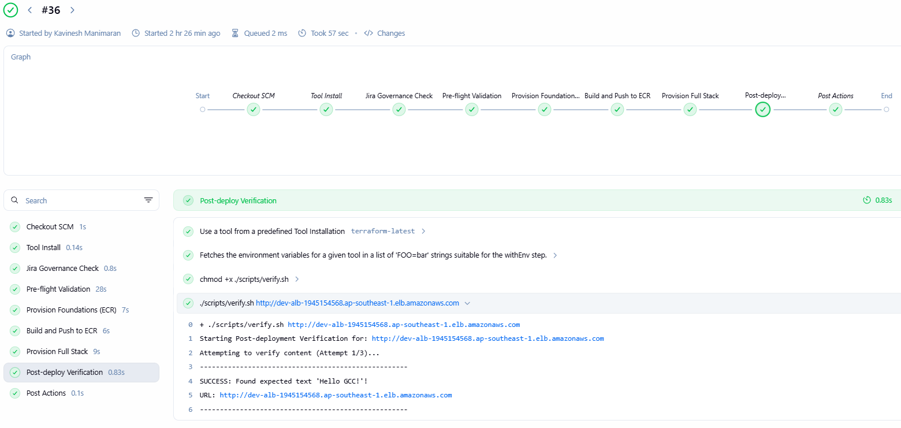
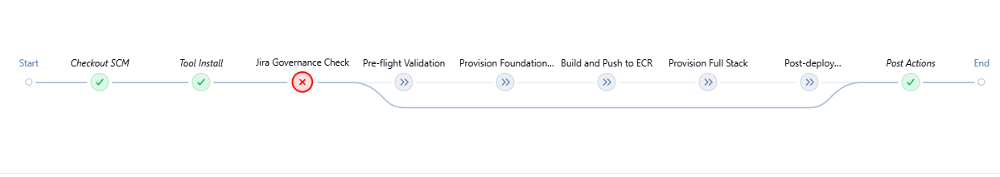
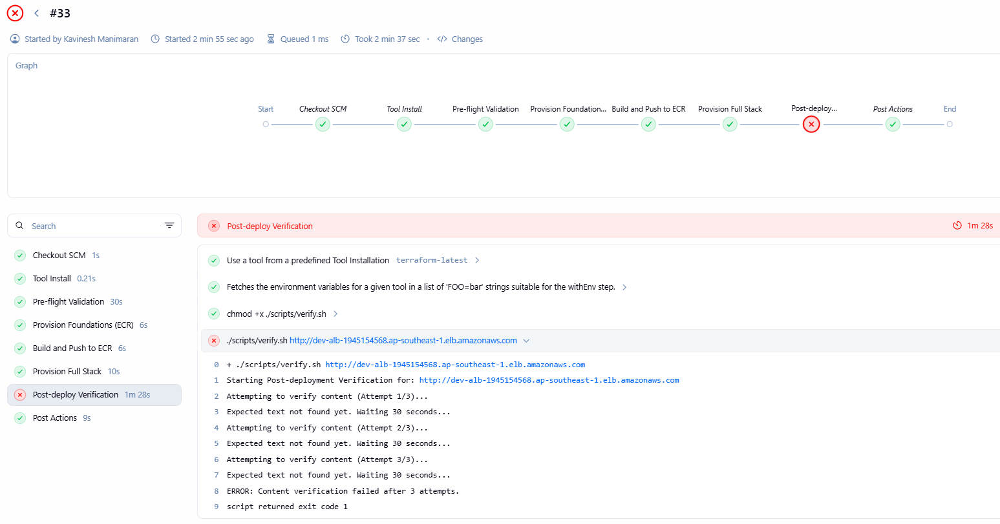
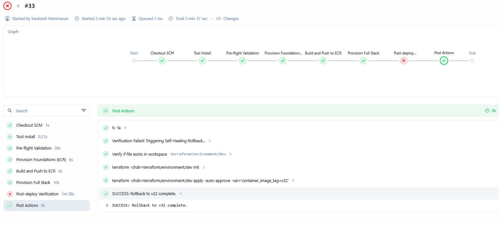

# gcc-cloud-assignment
GCC Cloud Assignment Repo

# GCC Gov-Cloud Deployment Pipeline

This project is my submission for Assignments 1, 2, and 3. It shows a fully automated, secure AWS environment managed by Terraform and Jenkins, with built-in "Self-Healing" and Jira governance.

## What this project does
1.  **Sets up AWS:** Creates a secure VPC, private subnets, and IAM roles using Terraform.
2.  **Enforces Rules:** A Jenkins pipeline checks every change for a Jira ticket before it starts.
3.  **Deploys Safely:** Builds a Docker app, pushes it to ECR, and deploys to EC2/ALB.
4.  **Self-Heals:** If the app fails a health check, the pipeline automatically rolls back to the last working version.

## Project Structure
* `/terraform`: All Infrastructure-as-Code files (VPC, IAM, S3, KMS).
* `/app`: The sample web application code.
* `/scripts`: Helper scripts for Pre-flight checks (`validate.sh`) and health checks (`verify.sh`).
* `Jenkinsfile`: The "brain" of the project that runs the whole pipeline.

## Security & Compliance
This project follows the **SHIP-HAT** standards:
* **Jira Ticket Enforcement:** No ticket = No deployment.
* **Least Privilege:** Each part of the app only has the exact AWS permissions it needs.
* **Encryption:** All data in S3 and ECR is locked with AWS KMS keys.

## Proof of Work
### 1. Successful Deployment

*The final "Green" build showing the app is live.*

### 2. Jira Enforcement (Failure Test)

*Evidence of the pipeline blocking a change that didn't have a GCC ticket ID.*

### 3. Post-deploy (Failure Test)

*Evidence of the pipeline post deployment fail due to error in app service detected.*

### 4. Automated Rollback (Self-Healing)

*Evidence from Assignment 2 where a bad version was detected and reverted.*

## How to run it
1. Push your code to the repository.
2. Ensure your commit message starts with `GCC-XXX:`.
3. Jenkins will automatically trigger the build.
4. Check the ALB URL output at the end to see the live app.